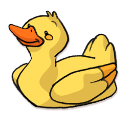

<!-- AUTO-GENERATED-CONTENT:START (STARTER) -->

    

<h1 align="center">
  Duck Friend
</h1>

This is my personal blog which is based on gatsby starters. Inspired by the duck debugging concept. I try to duck debug my way through life.
